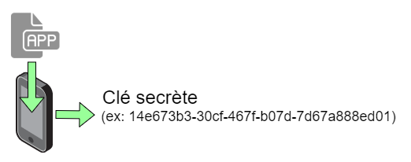
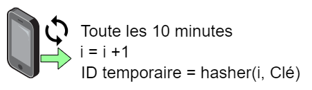
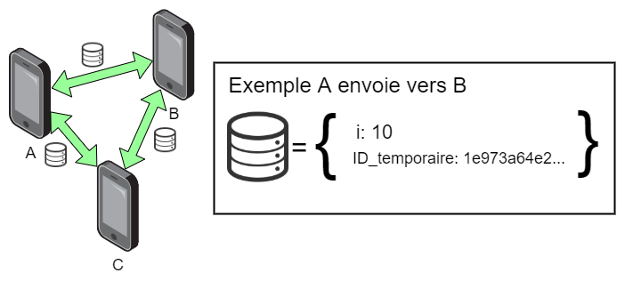
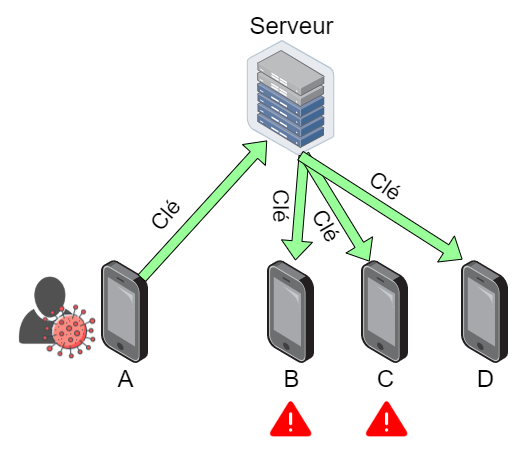

# POC Anonymisation des données

## Introduction

Le but de ce [POC](https://fr.wikipedia.org/wiki/Preuve_de_concept) est de prouver que l'on peut manipuler des informations permettant l'identification des contacts inter-appareils, en n'utilisant aucune information concernant le téléphone et donc implicitement la personne qui le détient.

## Protocole

À l'installation de l'application un identifiant unique est généré, il s'agit de la clé secrète. ([UUID](https://fr.wikipedia.org/wiki/Universal_Unique_Identifier))



À intervalles réguliers, l'application incrémente un compteur `i` et l'utilise dans une fonction de hachage pour générer un identifiant temporaire.



Par exemple :
```dart
cle = "14e673b3-30cf-467f-b07d-7d67a888ed01"
i = 10
ID_temporaire = hacher(i, cle)
// ID_temporaire vaut 1e973a64e2be2c3f89da1c12e080ab0322ccaa2fbce2a8fe07f40ed4de45868b7711af66cdeecefce81cd7751a6373757ae6258802a39dac3ddadd7ae6f0ba34
```

Lorsque des appareils rentrent en contacts, ils s'échangent leur identifiant temporaire et leur compteur `i`. Les données reçues sont sauvegardés dans l'appareil.



Si un utilisateur est diagnostiqué porteur d'un virus, il peut volontairement signaler son état. Pour cela l'application met à disposition un bouton qui engendrera les interactions suivantes :
1. L'application envoie la clé au serveur.
2. Le serveur propage la clé sur tous les appareils.
3. Chaque appareil compare la clé avec les identifiants temporaires qu'il a échangé.
	1. L'application va hacher la clé reçue par le `i` de chaque informations échangées.
	2. Si le résultat du hachage correspond à l'identifiant échangé alors il y a eu un contact.
4. L'appareil signal au cas échéant le risque de contamination.



Exemple, le téléphone `B` à échangé les informations suivantes :

|  i   |                        ID_temporaire                         |
| :--: | :----------------------------------------------------------: |
| 655  | 73a0076bc8fecb07f7b191499c775c298afe2db55d4b53209d996a8e9d8177... |
|  10  | 1e973a64e2be2c3f89da1c12e080ab0322ccaa2fbce2a8fe07f40ed4de45868... |
|  22  | e6be5cbb9d84a45c140a6e9971f8be4e5547240765978055016df00f109e2d... |
|  10  | a27a409da2214f0a56b6600a99bbc6e26f06c011b6cff56b81634558d200a35... |

À la réception de la clé `14e673b3-30cf-467f-b07d-7d67a888ed01`, il va exécuter l'algorithme décris précédemment ce qui donne : 

(`résultat = hacher(i, clé)`)

|  i   |               ID_temporaire               |                 résultat                  |
| :--: | :---------------------------------------: | :---------------------------------------: |
| 655  |  73a0076bc8fecb07f7b191499c775c298af...   |   ea70e2bf80c804320c5d34dba1f2a85360...   |
|  10  | **1e973a64e2be2c3f89da1c12e080ab0322...** | **1e973a64e2be2c3f89da1c12e080ab0322...** |
|  22  |   e6be5cbb9d84a45c140a6e9971f8be4e55...   |   327b817a30758c2be5a91f4dbac0b6134e...   |
|  10  |   a27a409da2214f0a56b6600a99bbc6e26f...   |   1e973a64e2be2c3f89da1c12e080ab0322...   |

Ici la deuxième ligne a un résultat correspondant à l'identifiant temporaire, il y a donc eu un contact entre le téléphone `B` et un porteur du virus.

## Code

Le POC est réalisé via *Flutter*, les codes suivant sont donc en langage Dart.

Voici les fonctions clés permettant le fonctionnement du protocole.

Génération de l'identifiant unique à l’installation.
```dart
String generateUUID() {
  var uuid = new Uuid();
  return uuid.v4(options: {'rng': UuidUtil.cryptoRNG});
}
```
Génération d'un identifiant temporaire.
```dart
String generateTempID(String i, String hash) {
  var key = utf8.encode(hash);
  var bytes = utf8.encode(i);
  var hmac = new Hmac(sha512, key);
  return hmac.convert(bytes).toString();
}
```
Comparaison des identifiants temporaires et des clés envoyés par le serveur.
```dart
bool compareAllHash() {
  var risk = false;
  for (final y in BACKEND_LIST) {
    for (final z in BLUETOOTH_MEETINGS) {
      if (z["hash"] == generateTempID(z["i"].toString(), y)) {
        risk = true;
      }
    }
  }
  return risk;
}
```

## Remarques

- Pour lancer l’application, il faut l'installer via le fichier **POCOVID.apk** sur un smartphone ou un émulateur Android. 

- Les informations qui transitent ne permettent pas d'identifier directement un appareil. De plus ce ne sont que les clés des personnes volontaires qui seront connues par le serveur, celui-ci supprimera les données au bout de 14 jours consécutifs. (temps d'incubation)

- Dans ce POC les communications par *Bluetooth* et les interactions avec le serveur sont émulées, car toutes les fonctionnalités d'anonymisation ainsi que le suivi du protocole sont assurés par l'application.